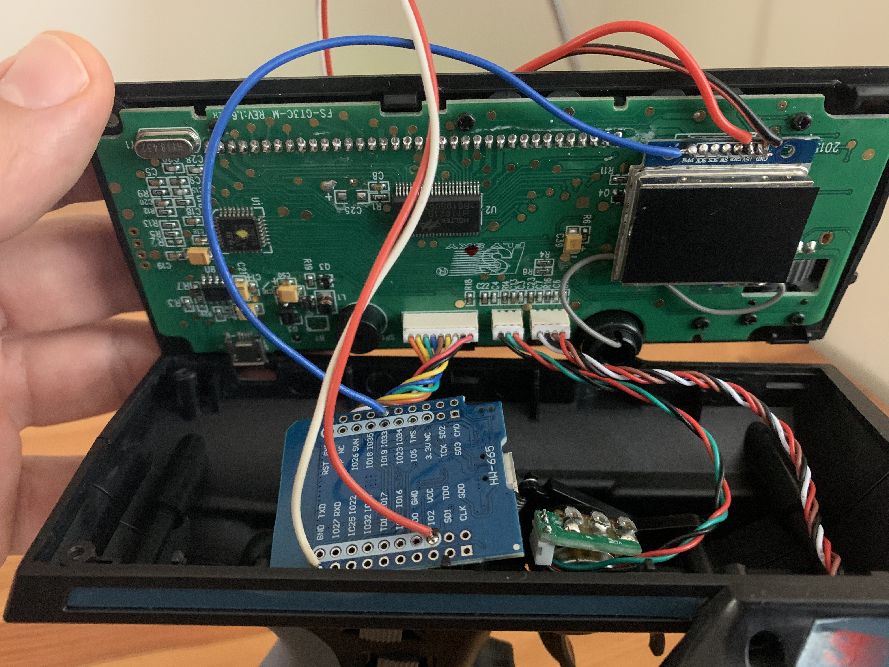
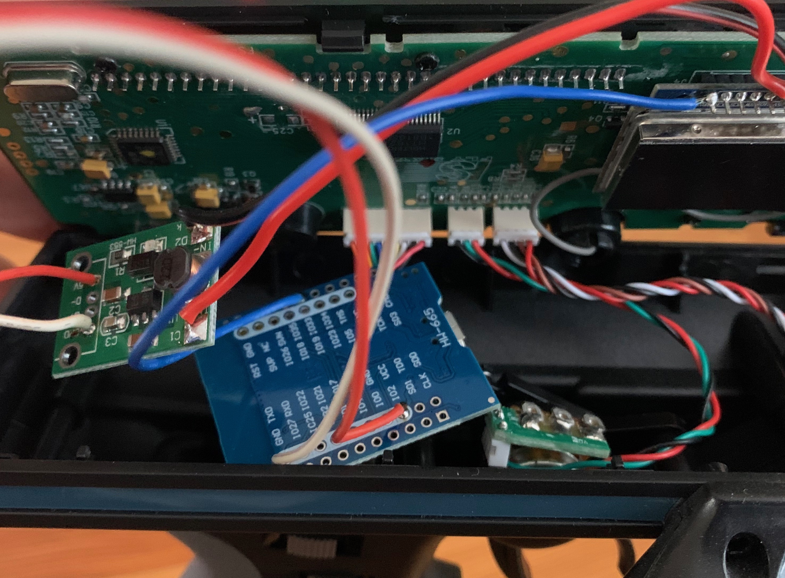

# buwizz_rc
Controll a BuWizz unit with ESP32 and PPM RC remote

## The BuWizz protocol
Istvan Murvai has a great deatiled document on the protocol:
https://github.com/imurvai/brickcontroller2/blob/master/BuWizz_protocol.md

## PPM vs PWM
I used the PPM (Pulse Position Modulation) signal from the transmitter.
The reason behind this, because it's easier. I've tried to decode the 2 channel PWM (Pulse Width Modulation) from a receiver, but I got a lot of lag and missed actions, I couldn't catch 2 different interrupts at a time.
Get's even worse, if we want more channels.
In a PPM signal, all channel infromation are in 1 signal, can't miss a thing there.

The interrupt code was found somewhere on the internet, instructables maybe.

## BLE connenction
Based on the example code in the ESP32 libary

## FlySky GT3C
The ESP can directly connect to the PPM pin in the transmitter. I've never measured above 3.7V here.
3.3 would be better, but... well... the smoke is still in the ESP32 :)

However, the 5V pin is not 5V, it's only the battery voltage, so 4.2 maximum, this is not enough for the ESP32. A separate battery-to-5V module was needed to add.

